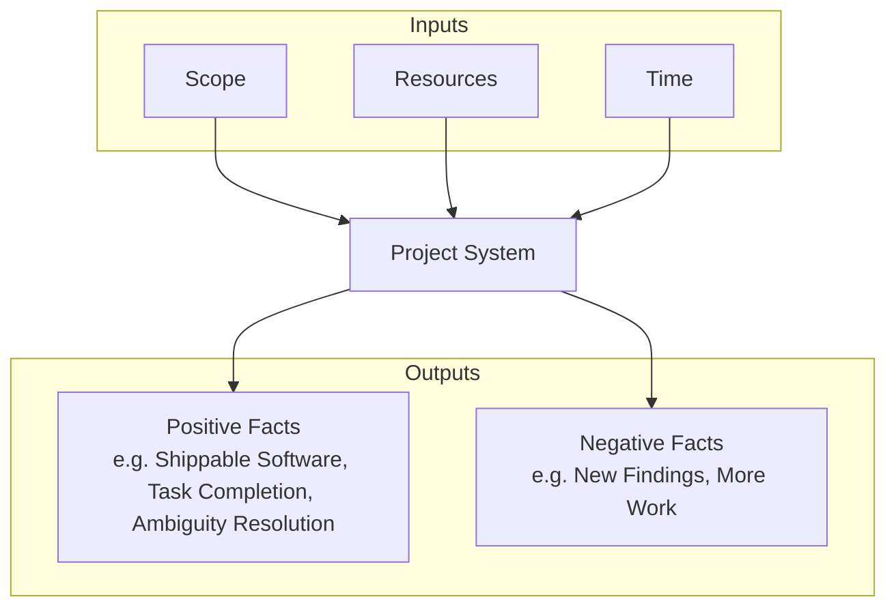
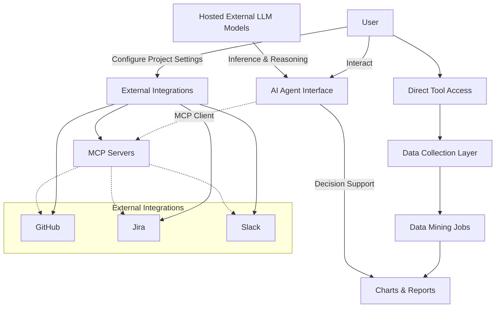

# Overview
This document is about the idea of a senior tech leader in a software technology company whose goal is to execute large projects involving cross functional teams.
The scope of responsibility of the senior tech leader involves people, processes, and tech decision-making. Large projects face several challenges. 

The idea here is to build an AI-based assistant that can help the tech leader prioritize and focus on the most important aspects of the project. The tool should analyze data (project input and incremental output) and suggest the most efficient path to success. The tool should be able to quantify all possible inputs over time, their possible variations, and chart out different possible project plans.

# Project Inputs and Outputs
A system where the output is a successful execution of a project and the inputs are variables like Scope, Resources available, and time period.

## Project Inputs and Outputs Diagram

Below is a conceptual diagram showing how project inputs flow into the system and result in different types of outputs (facts):

**Inputs:**
- **Scope**: Project goals (business, release)
- **Resources**: People, tools, processes, constraints
- **Time**: Duration, incremental goals

**Outputs:**
- **Positive Facts**: Result artifacts, task completions, ambiguity resolution
- **Negative Facts**: New findings, additional work

# Role of AI ecosystem in solving this
The tech leader, as a human being, tries to understand the project inputs, starts executing it with a team(s), and regularly measures the output. In this process, decisions are made and refined based , typically on a weekly basis.

A small tactical error in initial phases may have a large strategic deviation in the expected project outcome. This tactical decision-making is subject to human error and much depends on the style of the tech leader's personality and biases. The goal of this tool is to remove biases and help make more objective decisions.

This is possible if the right data is analyzed as the project progresses. Continuous data gathering is therefore crucial. This continuous data gathering needs to be correctly mapped to decision-making. 

Therefore, discovered data points need to be mapped to industry best practices to make correct forecasting and decisions.

There are plenty of industry best practices, and the correct practice (model or process) should be used for decision-making. A tech leader is typically very well trained in the particular domain. So, the tool needs to support domain-specific decision models. 

LLMs are typically very good at getting this right or at least getting to the point of proposing multiple models/approaches. AI toolsets are good at analyzing large data points and providing reasoning.

This tool will use LLMs as the subject matter expert. The weekly analysis output should include, but not be limited to:
- What is going right?
- What is going wrong?
- What should be the immediate priority and what should not be?
- Who are the people to talk to?
- Graphical representation of the project forecast against goals and how different decisions can impact the trajectory.

Technically speaking, here are some of the common tactical questions tech leaders need to ask on a weekly basis:
- Senior executives
  - Is my budget allocation correct? 
  - What elements of this project are unique?
  - What are my risks?
  - What can wait and what needs to be prioritized?
  - Who are the most valued team members?
  - How do I identify skill set gaps?

- Program Managers:
  - What are the right metrics to chase? What should I tune for this project.
  - Whom should I chase for more efficiennt resolution of an escalation
  - How do I minimize large group meetings that drain away company money

- Senior developers: 
  - Where should I focus on code refactoring?
  - Are there some files that are always changing together in every commit? Why, then, are they separate? Why isn’t there a dependency?
  - Where should unit test coverage focus more?

- Management:
  - Whom should I move to another team?
  - Will this scrum team function better with a size change (increase/decrease)?
  - Where should I invest for the highest value for the buck?

- General
  - Who is the knowledge owner of this module/launch-service?
  - Whom should I communicate with in another scrum team or another service?
  - Who are the key developers?

- CE team:
  - Where are defects likely to show up?
  - Which files should I learn more about as part of KT?

- Developers
  - Developer, you looked at this file, then looked at this and that file? (Like online shopping tips)

# Technical Tool Architecture High-Level Overview
The scope if to build tool whose backend uses AI toolset. A base AI agent serves as the interface for the user in addition to specific project settings that the user will configure (e.g., giving access to GitHub, Jira, Confluence, Google docs, sharepoint, Salesforce, Slack, emails, org chart, etc.). The data collection will be a mix of MCP servers and direct tool access. The MCP servers will be a mix of modified off-the-shelf MCP servers for user-specific access control plus existing MCP servers for non-user-specific workflows. There will also be data mining jobs that are constant mining for data points for decisioning making, building charts and reports.

## High-Level Tool Architecture Diagram

**Note:**
Other supported external tools include Confluence, Google Docs, SharePoint, Salesforce, Emails, Org Chart, and more. These can be configured as needed for your organization but are not shown in the diagram for clarity.

# Tech Stack Choice
- Backend
  - FastAPI
  - AI / analytics services
  - Async job execution
  - Caching (Redis)

- UI
  - Dash
  - Plotly figures
  - Parameter controls (sliders, dropdowns)

- Integration
  - Dash mounted under /app
  - FastAPI under /api
  - Shared auth and config

- This keeps:
  - Python end-to-end
  - Browser-based UI
  - Minimal tech sprawl
 
- Deployment
  - Docker for containerization
  - Queue event-based backend processing for long-running tasks.
  - AWS RDS Postgres SQL for DB
  - AWS for hosting

# Notes
If I take this route (Dash + FastAPI), what are my deployment options? My preference is to deploy it in AWS. I want to host multiple pages under a web portal with top or sidebar-based navigation.

This is a good, realistic stack, and AWS gives you several clean deployment paths. I’ll walk through this from architecture → deployment → navigation, focusing on options that scale without over-engineering.

1. First: Dash + FastAPI deployment model (important)

Dash is also ASGI-compatible (via Flask/Werkzeug internally, mounted through WSGI → ASGI adapters). In practice, there are two sensible deployment shapes:

Model A — Single ASGI app (recommended)
  FastAPI = /api
  Dash = /app (or /)
  One container, one process model
  One load balancer target

This is the simplest and works very well up to moderate traffic.

Model B — Separate services
  FastAPI service
  Dash service
  Shared auth, same domain
  More scalable, more ops work

For a side project, Model A is strongly preferred.

2. AWS deployment options (ranked best → worst for your case)
✅ Option 1: AWS ECS (Fargate) – Best overall choice

This is the sweet spot between control and simplicity.

Why ECS Fargate fits you
  No server management
  Native Docker workflow
  Scales horizontally
  Plays nicely with ASGI apps
  Easy to attach ALB + HTTPS
  Long-running analytics jobs supported

Typical setup

  Docker container running:
  Uvicorn / Gunicorn
  FastAPI + Dash mounted
  Application Load Balancer
  ACM TLS certificate
  Route53 DNS

Scaling
  Scale by CPU / memory
  Later split API & UI if needed

This is the most common production choice for Dash + FastAPI.