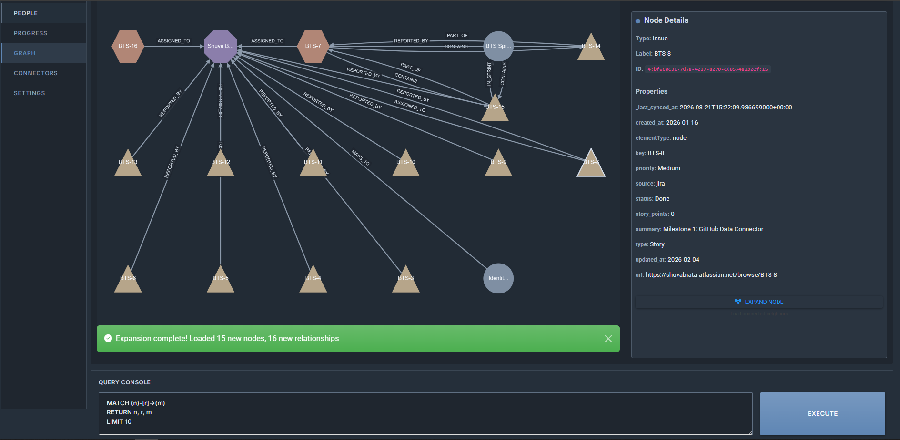
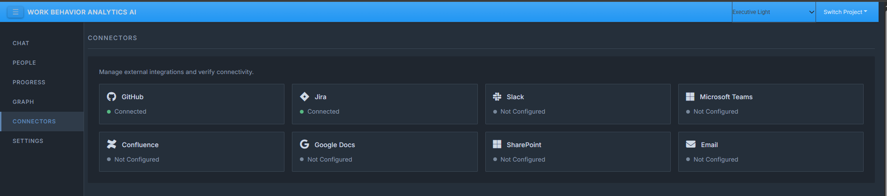
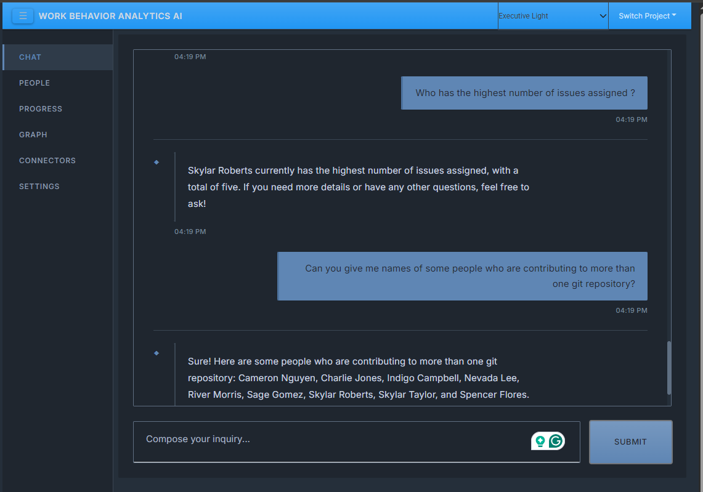

```
 __        ______    _              _    ___ 
 \ \      / / __ )  / \            / \  |_ _|
  \ \ /\ / /|  _ \ / _ \          / _ \  | | 
   \ V  V / | |_) / ___ \        / ___ \ | | 
    \_/\_/  |____/_/   \_\      /_/   \_\___|
                                             
```

# Work Behavior Analytics AI

**Work Behavior Analytics AI** is an AI-powered assistant designed to help senior tech leaders execute large cross-functional projects by making objective, data-driven decisions. 

The system analyzes project data from various enterprise productivity tools (such as GitHub, Jira, and Confluence) and provides actionable insights through a natural language chat interface and interactive graph vizualizations. By analyzing project inputs and tracking incremental outputs, the tool helps remove human biases and highlights project trajectories, potential risks, and immediate priorities.

## Key Features

* **AI Chat Interface**: A conversational interface powered by LLMs (OpenAI or custom) augmented with project context via LangChain.
* **Employee Relationship Graph**: Uses Neo4j to model relationships between employees based on collaboration patterns (commits, PR reviews, Jira tickets, etc.).
* **Objective Insights**: Answers tactical questions about team performance, code hotspots, project health, and resource allocation.
* **Privacy-First & Self-Hosted**: Designed as a run-anywhere, self-hosted Dockerized solution, ensuring that sensitive organizational data remains within your local trust boundary.
* **Executive Dashboard UI**: A professional, refined web interface built with Dash for exploring project progress, settings, and visualizing interactive data graphs.

## Screenshots





## Technology Stack

* **Backend**: Python, FastAPI, PostgreSQL (asyncpg, SQLAlchemy, Alembic)
* **Frontend**: Dash, dash-bootstrap-components, Dash Cytoscape (for graph visualization)
* **AI / Analytics**: LangChain, user-configurable LLM backends (OpenAI or local)
* **Graph Database**: Neo4j 
* **Infrastructure**: Docker & Docker Compose

## Documentation Links

- [Quick Start Guide](quick-start.md)
- [User Guide](USER_GUIDE.md)
- [High Level Design](high-level-design.md)
