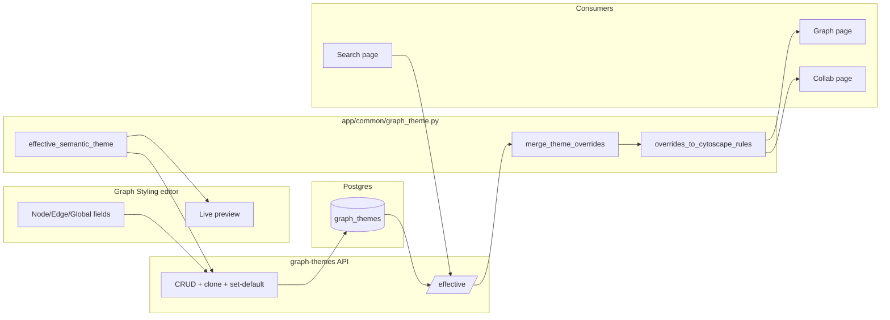

# Graph Themes Design

**Audience:** Developers implementing or extending user-configurable graph
themes (node/edge/global styling).

---

## Overview

Graph node/edge styling (shape, color, size, **label font size**) is defined by
a hardcoded base palette (`THEME_TOKENS` in `src/app/dash_app/styles.py`). This
design adds **named "Graph Themes"** stored in Postgres. Each theme carries
per-nodeType overrides (color, border, border-width, shape, width, height) plus
edge and global styling — including node and edge **label font size** — that
are merged **over** the hardcoded base at render time.

A REST API serves CRUD plus a server-merged `/effective` endpoint. A "Graph
Styling" settings page lets users create/edit themes with a live preview.
Graph, Collaboration Network, and Search all consume the same merged output.

---

## Core Concepts

### Base tokens are the single source of truth

The hardcoded `THEME_TOKENS` registry (per base mode `executive-light` /
`executive-dark`) remains the authoritative *base*. A theme row stores only
what it changes. The effective theme is always computed:

```text
effective = base_tokens (code)  ⊕  overrides (DB)
```

### Deltas vs. full snapshots

Two storage strategies exist, scoped by `source`:

- **Builtin themes** (`source = builtin`) store **sparse deltas** — only the
  properties they change. They track the base palette: if the base changes,
  the builtin theme follows it.
- **User themes** (`source = user`) store **full snapshots** — every field
  materialized (including the untyped `default` node, which has no editor
  card). This makes user themes **immune to future base-palette changes**: the
  editor displays *effective* values (no blank "inherit" fields), and a user's
  saved theme never silently shifts when the base palette evolves.

The snapshot is produced server-side by
`effective_semantic_theme(base_tokens, submitted_overrides)` on
create/update/clone.

### Semantic keys, translated once

Themes use **semantic keys** (`color`, `border`, `border_width`, `shape`,
`width`, `height` for nodes; `line_color`, `width`, `arrow_shape`,
`label_color`, `edge_label_font_size` for edges; `node_label_color`,
`node_label_font_size`, `selection_color`, `edge_label_background` for global).
Translation from semantic key to Cytoscape property happens in **one** layer
(`app/common/graph_theme.py`), so consumers never re-map keys.

Dimensions are stored as **plain numeric px** (no `"px"` suffix) and rendered
as e.g. `"80px"` strings at translation time. Label font sizes follow the same
convention: `node_label_font_size` / `edge_label_font_size` are plain int px
(validated `ge=8, le=48`) and are resolved to concrete values against base
tokens (`graph.node.label.font.size`, `graph.edge.label.font.size`) in both
`effective_semantic_theme` (editors/snapshots) and `merge_theme_overrides`
(Cytoscape rules).

> **Label truncation is NOT a theme concern.** The maximum number of characters
> shown in a node label is owned by the runtime setting
> `GRAPH_UI_MAX_NODE_LABEL_CHARS` (Settings → Runtime Settings), not by a
> graph theme. A link on the Graph Styling editor's Global card points there.
> Graph and Collaboration Network truncate using this single source.

### Base mode source

The app's existing `theme-store` toggle (light/dark) is the base mode. There
is **no separate graph mode selector** — a theme's `base_theme` column
(`executive-light` | `executive-dark`) selects which base palette it merges
over.

---

## Non-Goals

- Layout/zoom/physics theming, **font family**, `curve-style`, `arrow-scale`,
  `control-point-step-size`, label `text-wrap` / `text-max-width` (additive
  later without schema rewrite). Label **font size** (node + edge) is in scope.
- Per-edge or per-node-instance styling (themes are per-nodeType).
- Caching of the effective theme (a fresh DB query per render is cheap at
  single-user scale).
- Live re-fetch on change (refresh-on-navigation only; no polling/websocket).

---

## Database Layer

### Table: `graph_themes`

| Column | Type | Notes |
|---|---|---|
| `id` | int PK | |
| `name` | str | unique per `base_theme` |
| `base_theme` | str | `executive-light` \| `executive-dark` |
| `is_default` | bool | partial unique index on `(base_theme) WHERE is_default` |
| `overrides` | JSONB | structured override doc (contract below) |
| `source` | str | `builtin` \| `user` |
| `created_at` / `updated_at` | timestamptz | |

### Constraints

- **`uq_graph_themes_name_base_theme`** — `name` unique within a `base_theme`.
- **`uq_graph_themes_default_per_base`** — partial unique index
  `ON graph_themes (base_theme) WHERE is_default`. Enforces **at most one
  default per base mode**. `is_default` is a plain NOT NULL boolean (`false`
  for non-default rows) so the `WHERE is_default` predicate permits only a
  single `TRUE` row per base mode.

### Seeding

The migration seeds, per base mode, one empty immutable **"Default" anchor**
(`source = builtin`, `is_default = true`, empty overrides) plus one
illustrative example theme (`source = builtin`). Seeding is idempotent
(`ON CONFLICT (name, base_theme) DO NOTHING`).

### Override JSONB contract

```json
{
  "nodes": {
    "Person": {"color": "#00FF00", "border": "#008800", "border_width": 2,
               "shape": "diamond", "width": 80, "height": 60},
    "default": {"color": "#CCCCCC"}
  },
  "edges": {
    "line_color": "#999999", "width": 3,
    "arrow_shape": "triangle", "label_color": "#666666",
    "edge_label_font_size": 11
  },
  "global": {
    "node_label_color": "#FFFFFF",
    "node_label_font_size": 14,
    "selection_color": "#FFAA00",
    "edge_label_background": "#222222"
  }
}
```

- `nodes.<Type>` keys mirror the existing `nodeType` values (`Person`,
  `Project`, `Issue`, `Epic`, `Repository`, `Branch`, `Team`,
  `IdentityMapping`, `Initiative`, `Sprint`, `Commit`, `File`, `PullRequest`,
  `Space`, `Page`, `Blogpost`) plus `default` for untyped nodes.
- `border_width` accepts `0` (no border) so full-snapshot themes can explicitly
  freeze the base's borderless default.
- `node_label_font_size` / `edge_label_font_size` are plain int px
  (`ge=8, le=48`); when omitted they resolve to the base tokens
  `graph.node.label.font.size` (11) / `graph.edge.label.font.size` (9).
- Validation (hex colors, shape names, numeric bounds, node-type keys) is
  enforced by the Pydantic models in `app/common/graph_theme.py`.

---

## Shared Core (`app/common/graph_theme.py`)

A **pure** module — it never imports the UI layer. Base tokens are passed in as
arguments so it runs in isolation (unit tests, API layer, connectors) and the
base palette can evolve independently. It is the single source of truth for:

- `NODE_TYPES` — the override-aware nodeType keys (incl. `default`).
- `ALLOWED_SHAPES` — the full Cytoscape node shape set.
- `NodeOverride` / `EdgeOverride` / `GlobalOverride` / `ThemeOverrides` —
  Pydantic override-document models (shared by the API and the merge core).
- `merge_theme_overrides(base_tokens, overrides)` — returns the **effective
  theme** in Cytoscape space (semantic keys re-mapped to Cytoscape properties).
- `effective_semantic_theme(base_tokens, overrides)` — returns the full
  effective theme in **semantic** space (editor-facing; used to materialize
  user-theme snapshots).
- `overrides_to_cytoscape_rules(merged_tokens)` — turns an effective-theme
  document into a list of Cytoscape rule dicts.
- `parse_overrides(data)` — validates a raw override doc into `ThemeOverrides`.

### Two output spaces

| Function | Space | Consumer |
|---|---|---|
| `merge_theme_overrides` | Cytoscape (`background-color`, `"80px"`, ...) | Graph / Collab / Search rendering |
| `effective_semantic_theme` | Semantic (`color`, `80`, ...) | Editor display + user-theme snapshots |

---

## API Layer

Domain `graph-themes` under `src/app/api/graph_themes/v1/`
(router/service/query/models, mirroring `settings/v1`).

| Method | Path | Purpose |
|---|---|---|
| GET | `/api/v1/graph-themes/` | List all themes |
| POST | `/api/v1/graph-themes/` | Create a user theme |
| GET | `/api/v1/graph-themes/{id}` | Fetch one theme |
| PATCH | `/api/v1/graph-themes/{id}` | Update a user theme (builtin → 409) |
| DELETE | `/api/v1/graph-themes/{id}` | Delete a user theme (builtin → 409) |
| POST | `/api/v1/graph-themes/{id}/set-default` | Clear old + set new (txn) |
| POST | `/api/v1/graph-themes/{id}/clone` | Copy-on-write (builtin → new user row) |
| GET | `/api/v1/graph-themes/effective?base_theme=` | Merged tokens |

`/effective` returns **merged tokens** (base ⊕ overrides), not a Cytoscape
stylesheet. The client's `build_cytoscape_stylesheet()` turns tokens into
rules.

### Effective-theme resolution

`get_effective_theme(base_theme)`:

1. Validate `base_theme` against `VALID_BASE_THEMES` (unknown → 422).
2. Load the hardcoded base tokens for the mode.
3. Load the **default** theme for the mode (if any) for overrides; otherwise
   the empty "Default" anchor (no overrides).
4. Return `merge_theme_overrides(base_tokens, overrides)`.

### Service invariants

- **Builtin immutability** — `PATCH`/`DELETE` on a `builtin` row → 409. Editing
  a builtin must go through an explicit `clone` (copy-on-write).
- **Default protection** — `DELETE` of the current default → 409
  (`DefaultThemeError`), so a base mode never silently falls back to the
  hardcoded palette. The user must set another theme as default first.
- **Default swap** — `set-default` clears the prior default for the base mode
  and sets the new one in a transaction. The clear is flushed **before** the
  new default is set so the partial unique index never observes two defaults in
  a single statement batch.
- **Base change re-snapshot** — `PATCH` that changes `base_theme` re-materializes
  the stored full snapshot against the **new** base. Because a full snapshot is
  immune to base changes, the service first recovers the user's deltas (diffed
  against the old base via `_snapshot_delta`), then re-snapshots those deltas
  against the new base. Changing `base_theme` on a **default** theme → 409
  (same contract as deleting a default).
- **Duplicate names** — `name` unique per `base_theme`; a name collision → 409.

### Error mapping

Service-layer errors are custom `ValueError` subclasses
(`ThemeNotFoundError`, `BuiltinImmutableError`, `DefaultThemeError`,
`InvalidBaseThemeError`, `DuplicateNameError`). The router maps them to HTTP
status codes (404 / 409 / 422).

---

## UI Layer

### Consumers (render the effective theme)

All three pages fetch the server-merged effective theme and fall back to the
base palette on any error (the shared helper returns `None`).

- **Graph page** — `update_graph_stylesheet` fetches `/effective` for the
  current `theme-store` mode and feeds `build_cytoscape_stylesheet`.
- **Collaboration Network page** — a stylesheet callback mirrors Graph. Note:
  node **fill** is masked by community coloring on Collab, so shape/size
  overrides are the reliable way to verify propagation there.
- **Search page** — resolves node **badge fill** colors dynamically from
  `/effective` (no import-time token snapshot).

### Shared fetch helper

`fetch_effective_theme(base_theme) -> dict | None` lives in
`src/app/dash_app/pages/graph/utils/graph_operations.py`. It is the **single
fetch site** for `/effective`; all three consumers call it. It returns `None`
on any error so callers fall back to the base palette. The timeout comes from
`runtime_settings.get_int("HTTP_REQUEST_TIMEOUT")`.

### Stylesheet builder

`build_cytoscape_stylesheet(theme_name, effective=None)` in
`src/app/dash_app/pages/graph/styles.py`:

- Theme-derived rules (generic node, per-nodeType, edge, selected) come from
  the shared `overrides_to_cytoscape_rules(effective)`.
- The builder **enriches** those rules with stylesheet concerns (fonts, labels,
  arrows, selection border) and appends non-theme rules (community colors,
  highlight/dim, spotlight, `edge[normalized_weight]`,
  `edge.collaboration-edge`, `node[_render_width_px]`).
- Node label color: the generic node rule honors the `node_label_color`
  override while preserving the light-mode generic-vs-typed fallback
  distinction (generic `#1a202c`, typed `#f4f7fb`).

### Graph Styling editor page

Route `/app/settings/graph-styling` (Settings → "Graph Styling" card).

- **Two base-mode sections** (light/dark), each with a theme selector and a
  non-collapsible grid of node-type cards (fill/border/border-width/shape/
  width/height) plus an Edges card and a Global card.
- **Label font size** — the Global card exposes `node_label_font_size` (a
  single global node-label size) and the Edges card exposes
  `edge_label_font_size`, both as number inputs (8–48 px). The Edges card's
  live Cytoscape preview reflects `edge_label_font_size`; the node glyph
  preview renders no text and is unaffected.
- **Max-chars link** — the Global card carries a small inline link,
  *"Node label length (max chars) is set in Runtime Settings →"*, pointing to
  `/app/settings/runtime`. Label truncation is owned by the runtime setting,
  not a theme.
- **Effective values** — selecting a theme populates every field with its
  *effective* (concrete) value, so a sparse/no-override theme still shows what
  it actually renders. Effective node values are cached in a `dcc.Store` so the
  per-row reset button restores a row to its loaded values.
- **Live preview** — each node-type row carries an inline CSS glyph reflecting
  the row's current fill/border/border-width/shape/width/height in real time
  (aspect-ratio preserved, with a numeric `WxH` label). An Edges card preview
  uses a two-node Cytoscape component.
- **Actions** — New / Duplicate (clone) / Save (full-document PATCH) /
  Set-as-default / Delete. Builtin themes show "Duplicate to edit" rather than
  plain Edit. Set-as-default and Delete use a `dcc.ConfirmDialog` (2-stage
  callback pattern). Destructive buttons use `outline-danger`.
- **Feedback** — page-level dismissable alerts for success/error/warning.

---

## Data Flow



---

## Design Decisions

1. **Layered override** — hardcoded `THEME_TOKENS` is the fallback; DB themes
   carry overrides merged on top.
2. **Storage strategy** — builtin themes are sparse deltas (track the base);
   user themes are full snapshots (immune to base changes).
3. **Structured override doc** — a single JSONB `overrides` column with
   semantic keys.
4. **Out-of-the-box** — one empty immutable "Default" anchor plus one
   illustrative example theme per base mode.
5. **Server-side merge** — a single `/effective` endpoint returns merged
   tokens; the client assembles Cytoscape rules.
6. **Base mode source** — the app's `theme-store` toggle is the base mode; no
   separate graph mode selector.
7. **Single default per base** — enforced by a Postgres partial unique index.
8. **Builtin immutability** — builtin themes are immutable; editing one creates
   a new row via explicit `clone`.
9. **No caching** — `/effective` does a fresh DB query per render.
10. **Refresh-on-navigation** — no polling/websocket.
11. **Full shape set** — the complete Cytoscape shape vocabulary, not just the
    shapes currently in use.
12. **Label font size, single global node size** — node label font size is one
    global value (mirroring `node_label_color`), plus one edge label font size;
    not per-nodeType.
13. **Label sizes are plain px** — `node_label_font_size` / `edge_label_font_size`
    are int px (8–48) resolved to concrete values in both semantic and
    Cytoscape spaces; base tokens `graph.node.label.font.size` /
    `graph.edge.label.font.size` fall back to 11/9.
14. **Truncation is a runtime setting** — `GRAPH_UI_MAX_NODE_LABEL_CHARS`
    (Settings → Runtime Settings) owns the max chars shown in node labels, not
    a theme; the Global card links there, and Collab truncates from the same
    setting (no hardcoded length).

---

## Files

| Area | Location |
|---|---|
| Shared core | `src/app/common/graph_theme.py` |
| Base tokens (font sizes) | `src/app/dash_app/styles.py` (`THEME_TOKENS`) |
| DB model | `src/app/db/models/graph_theme.py` |
| Migration | `src/app/alembic/versions/..._add_graph_themes.py` |
| API | `src/app/api/graph_themes/v1/{models,query,service,router}.py` |
| Stylesheet builder | `src/app/dash_app/pages/graph/styles.py` |
| Shared fetch helper | `src/app/dash_app/pages/graph/utils/graph_operations.py` |
| Consumers | Graph `callbacks/display.py`, Collab `callbacks/display.py`, `search.py` |
| Editor page | `src/app/dash_app/pages/settings/graph_styling/` |
| Collab truncation | `src/app/analytics/collaboration/algorithm.py` |